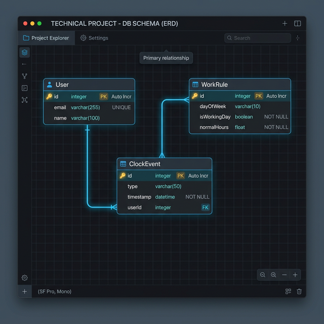
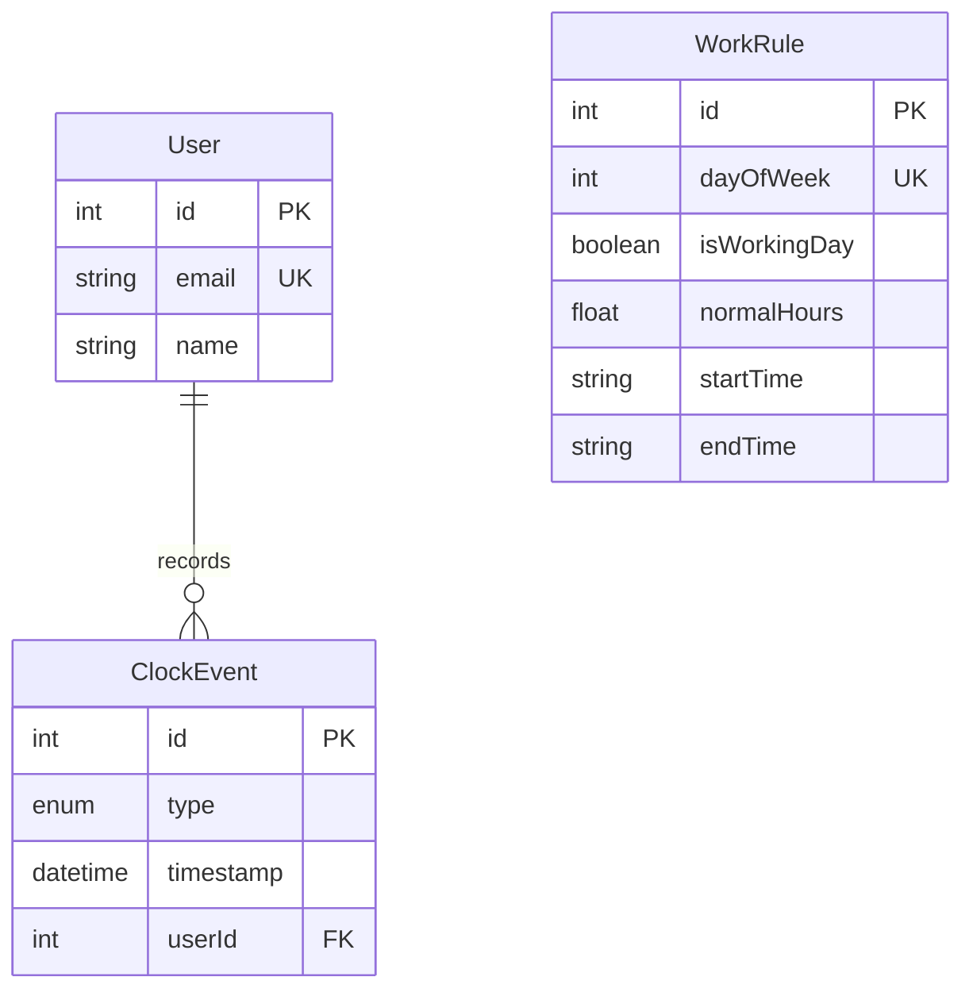

# Time-Recording System 

[](#) [](#) [](#) [](#) [](#)
<br />
[](#)

A concurrency-safe time-recording REST API with a **simple dashboard**, built with **Node.js**, **TypeScript**, **Express v5**, **Prisma ORM**, and **SQLite**.

## Table of Contents

- [Architecture](#architecture)
- [Frontend Dashboard](#frontend-dashboard)
- [Security](#security)
- [Setup & Run](#setup--run)
- [Database Schema](#database-schema)
- [API Reference](#api-reference)
- [Concurrency & Resource Contention](#concurrency--resource-contention)
- [Author's Note & Implementation Choices](#authors-note--implementation-choices)
- [Assumptions](#assumptions)
- [Design Trade-offs](#design-trade-offs)
- [Running Tests](#running-tests)

---

## Architecture

```
src/
├── index.ts                  # Express app, security middleware, graceful shutdown
├── errors.ts                 # Typed error hierarchy (AppError, ConflictError, etc.)
├── schemas.ts                # Zod validation schemas for all endpoints
├── lib/
│   └── prisma.ts             # Singleton PrismaClient
├── middleware/
│   └── errorHandler.ts       # Centralized error → HTTP response mapping
├── routes/
│   ├── clock.routes.ts       # POST /api/clock, GET /api/clock/status/:userId
│   ├── events.routes.ts      # CRUD: GET/PUT/DELETE /api/events
│   ├── report.routes.ts      # GET /api/report
│   └── users.routes.ts       # POST/GET /api/users
├── services/
│   ├── clockService.ts       # Clock state machine, CRUD logic, transactions
│   └── reportService.ts      # Overtime calculation, daily aggregation
public/
├── index.html                # Dashboard UI (skeuomorphic hardware design)
├── css/
│   └── style.css             # Full design system (~1400 lines)
├── js/
│   └── app.js                # Client logic (API calls, filters, live clock, connectors)
prisma/
├── schema.prisma             # Data model (User, ClockEvent, WorkRule)
├── migrations/               # Auto-generated SQL migrations
└── seed.ts                   # Seeds test user + work rules
tests/
└── concurrency.ts            # Full integration test suite
```

**Key patterns:**

- **Singleton Prisma Client**: prevents connection leaks during hot reload
- **Typed error classes**: `ConflictError(409)`, `NotFoundError(404)`, and `ValidationError(400)` flow to a centralized error handler
- **Service layer separation**: routes handle HTTP, while services handle business logic
- **Zod runtime validation**: every input (body, query, param) is strictly validated before execution
- **History invariants**: update and delete operations validate the full user history to prevent broken IN/OUT chains
- **Midnight session splitting**: reports split hours correctly across days for sessions that span midnight
- **Graceful shutdown**: `SIGINT` and `SIGTERM` disconnect Prisma before exit

---

## Frontend Dashboard

The dashboard UI is a **fully custom skeuomorphic design** — no frameworks, no component libraries — built with vanilla HTML, CSS, and JavaScript. Every element is crafted to look and feel like a physical piece of premium industrial hardware.

### Design Language

| Element         | Treatment                                                                                       |
| --------------- | ----------------------------------------------------------------------------------------------- |
| **Panels**      | Multi-layered "Outer Rim" with inner casing, pseudo-element depth floor, and surface gloss      |
| **LCD Screens** | Casio-style green displays with `JetBrains Mono` monospace type and ghost digit underlays       |
| **Buttons**     | 3D button caps inside machined wells with physical press animations                             |
| **Connectors**  | SVG system-bus traces between panels with groove + specular highlight (matching panel dividers) |
| **Feedback**    | Thermal "receipt printer" slip animation on clock-in/out actions                                |
| **Table**       | Date group separators, filter tabs with color-accented count badges, raised footer ledge        |

### Key Features

- **Live Clock**: Real-time hours, minutes, seconds with LCD display
- **Clock In/Out**: Physical push-buttons with tactile press feedback and receipt animation
- **Today's Summary**: Segmented progress bar showing hours worked vs. target
- **Recent Activity**: Filterable event log with IN/OUT/ALL tabs, date grouping, and total count footer
- **System Health**: Live diagnostic indicator polling `/api/health`
- **Panel Connectors**: Dynamically drawn SVG traces that bridge panels, responsive to layout changes

---

## Security

The API applies layered security based on current Node.js best practices:

| Layer                | Implementation                                      | Purpose                                                                     |
| -------------------- | --------------------------------------------------- | --------------------------------------------------------------------------- |
| **HTTP Headers**     | `helmet`                                            | Sets Content-Security-Policy, X-Frame-Options, X-Content-Type-Options, etc. |
| **CORS**             | `cors`                                              | Restricts origins (configurable via `CORS_ORIGIN` env var)                  |
| **Rate Limiting**    | `express-rate-limit`                                | 100 requests per 15 minutes per IP                                          |
| **Body Size**        | `express.json({ limit: '10kb' })`                   | Prevents large-payload DoS attacks                                          |
| **Input Validation** | `zod` (v4)                                          | Runtime schema validation on every endpoint with typed errors               |
| **Error Handling**   | Custom `AppError` hierarchy                         | Never leaks stack traces in production                                      |
| **Process Safety**   | `unhandledRejection` / `uncaughtException` handlers | Prevents silent crashes                                                     |

**Validation example:** sending invalid data returns structured errors:

```json
{
  "error": "Validation failed.",
  "details": [
    { "field": "userId", "message": "'userId' must be a positive integer." },
    { "field": "type", "message": "'type' must be 'IN' or 'OUT'." }
  ]
}
```

---

## Setup & Run

### Prerequisites

- Node.js ≥ 18
- npm

### Installation

```bash
# Install dependencies
npm install

# Create database and apply migrations
npx prisma migrate dev --name init

# Generate Prisma Client
npx prisma generate

# Seed default data (test user + work rules)
npx prisma db seed
# Creates test@example.com with id=1 (used in all API examples below) and Mon–Fri work rules (8h/day)
```

### Start the server

```bash
# Production mode
npm start

# Development mode (watches for changes)
npm run dev
```

The server starts at `http://localhost:3000`.

> **Dashboard:** Open **[http://localhost:3000](http://localhost:3000)** in your browser to access the interactive attendance dashboard. From there you can:
>
> - **Clock In / Clock Out** using the hardware-style buttons
> - **View real-time status** and live session duration
> - **Browse and filter** the full history of clock events (ALL / IN / OUT tabs)
> - **See today's progress** — hours worked vs. target, with overtime indicator

---

## Database Schema





- **User**: identity with unique email
- **ClockEvent**: each clock transition with type (IN/OUT) and timestamp, indexed on `(userId, timestamp)`
- **WorkRule**: one row per day of week (0=Sunday .. 6=Saturday), defining whether it is a working day, normal hours (8h), and expected work window (`startTime`/`endTime`, e.g. 09:00–18:00)

---

## API Reference

### Clock Events

#### Clock In/Out

```bash
# Clock in
curl -X POST http://localhost:3000/api/clock \
  -H "Content-Type: application/json" \
  -d '{"userId": 1, "type": "IN"}'

# Clock out
curl -X POST http://localhost:3000/api/clock \
  -H "Content-Type: application/json" \
  -d '{"userId": 1, "type": "OUT"}'
```

**Responses:**

- `201`: Event created successfully
- `400`: Missing or invalid parameters
- `409`: Invalid transition (for example, clocking in when already clocked in)

#### Get Clock Status

```bash
curl http://localhost:3000/api/clock/status/1
```

```json
{ "userId": 1, "status": "IN", "since": "2026-03-10T09:00:00.000Z" }
```

### CRUD: Time Records

#### List Events (paginated)

```bash
curl "http://localhost:3000/api/events?userId=1&page=1&limit=10"
```

```json
{
  "events": [...],
  "total": 42,
  "page": 1,
  "limit": 10,
  "totalPages": 5
}
```

#### Get Single Event

```bash
curl http://localhost:3000/api/events/1
```

#### Update Event Timestamp

```bash
curl -X PUT http://localhost:3000/api/events/1 \
  -H "Content-Type: application/json" \
  -d '{"timestamp": "2026-03-10T09:15:00Z"}'
```

#### Delete Event

```bash
curl -X DELETE http://localhost:3000/api/events/1
```

### Reporting

#### Generate Report

```bash
curl "http://localhost:3000/api/report?userId=1&start=2026-03-01&end=2026-03-31"
```

Date-only `start`/`end` values are normalized to UTC day boundaries, so a date-only `end` includes the full final day.

```json
{
  "userId": 1,
  "startDate": "2026-03-01T00:00:00.000Z",
  "endDate": "2026-03-31T23:59:59.999Z",
  "daily": [
    {
      "date": "2026-03-10",
      "isWorkday": true,
      "workedHours": 9.5,
      "normalHours": 8,
      "overtime": 1.5
    }
  ],
  "totals": {
    "workedHours": 9.5,
    "overtime": 1.5,
    "regularHours": 8
  }
}
```

### Users

#### Create User

```bash
curl -X POST http://localhost:3000/api/users \
  -H "Content-Type: application/json" \
  -d '{"email": "john@example.com", "name": "John"}'
```

#### List Users

```bash
curl http://localhost:3000/api/users
```

#### Get Single User

```bash
curl http://localhost:3000/api/users/1
```

---

## Concurrency & Resource Contention

Clock-in and clock-out mutations execute inside a Prisma `$transaction`. SQLite provides serialized write access at the database level, so only one write transaction proceeds at a time while the others wait. This guarantees that concurrent clock-in attempts for the same user produce exactly **1 success** and **N-1 conflict errors (409)**.

The included test suite validates this by firing 10 simultaneous `POST /api/clock` requests.

> **Trade-off:** In a production system with PostgreSQL, I would use `SELECT ... FOR UPDATE` (pessimistic row-level locking) inside the transaction to lock the user's last event row. That would allow concurrent writes for _different_ users while preventing races for the _same_ user.

---

## Author's Note & Implementation Choices

I approached this assignment with two goals: absolute correctness under concurrency and zero friction for the reviewer.

### Why this stack?

- **TypeScript & Node.js**: Given the flexibility to choose any language, I went with TypeScript. For a system tracking time and state (IN/OUT), the ability to define strict interfaces and catch type errors at compile-time is essential for preventing the kind of "off-by-one" bugs common in duration calculations.
- **SQLite over PostgreSQL**: I chose SQLite specifically for the reviewer's experience. You can `npm install && npm start` and everything "just works" without requiring Docker or a local database setup. It satisfies the relational requirement while keeping the barrier to entry non-existent.
- **Prisma ORM**: Prisma offers the best type-safe DX and auto-generated migrations. It effectively acts as living documentation for the database schema.

### Handling Complexity

I went a step beyond basic CRUD to handle real-world scenarios:

1.  **Midnight Boundaries & Session Clipping**: A common pitfall in time systems is sessions that cross midnight (e.g., 10 PM to 2 AM). My `ReportService` doesn't just subtract timestamps; it clips sessions to the report boundaries and splits them across UTC day boundaries so daily totals and overtime are mathematically precise.
2.  **Clock History Invariants**: Basic state machine logic works for `POST /api/clock`, but what happens if a user updates or deletes an old event? I implemented `assertValidHistory` to ensure that any mutation to a user's timeline preserves a valid IN/OUT chain. You can't delete an IN event if it leaves two OUT events back-to-back.
3.  **Concurrency Safety**: I used Prisma `$transaction` blocks to ensure that simultaneous clock-in requests for the same user result in exactly one success and appropriate conflict errors (409).

## Assumptions

To maintain a focused implementation, I made the following assumptions:

- **UTC Everywhere**: All timestamps are stored and computed in UTC to avoid timezone ambiguity.
- **Global Work Rules**: I assumed a standard work week (Mon-Fri, 8h/day) applies to all users for the purpose of this demo.
- **Chronological Integrity**: While the system validates transitions during modification, it assumes initial event records are submitted in real-time order.
- **No Authentication**: Per the requirement focusing on the logic and data operations, I've left auth out of scope to keep the core functionality clean and testable.

## Design Trade-offs

- **SQLite Concurrency**: I'm relying on SQLite's serialized write access. In a high-traffic production environment with PostgreSQL, I would use pessimistic row-level locking (`SELECT ... FOR UPDATE`) inside the transaction to allow higher throughput for different users.
- **In-Memory Aggregation**: For a take-home scale, I aggregate report data in-memory within the service. For millions of records, I would push this logic into the database via SQL views or stored procedures.

---

## Running Tests

With the server running (`npm start` in one terminal):

```bash
npm run test:concurrency
```

This runs a comprehensive suite covering:

- Clock-in / clock-out state transitions
- Duplicate clock-in/out rejection (409)
- Event CRUD (list, get, update, delete)
- Report generation with overtime
- Concurrency stress test (10 simultaneous requests)

## Code Maintainers

<table>
  <tr>
    <td align="center" valign="top">
      <a href="https://github.com/alexandephilia">
        <br />
        <sub><b>Alexandephilia</b></sub>
      </a><br />
      <sub>Architect</sub>
    </td>
    <td align="center" valign="top">
      <br />
      <sub><b>Claude</b></sub><br />
      <sub>Implementation</sub>
    </td>
  </tr>
</table>
